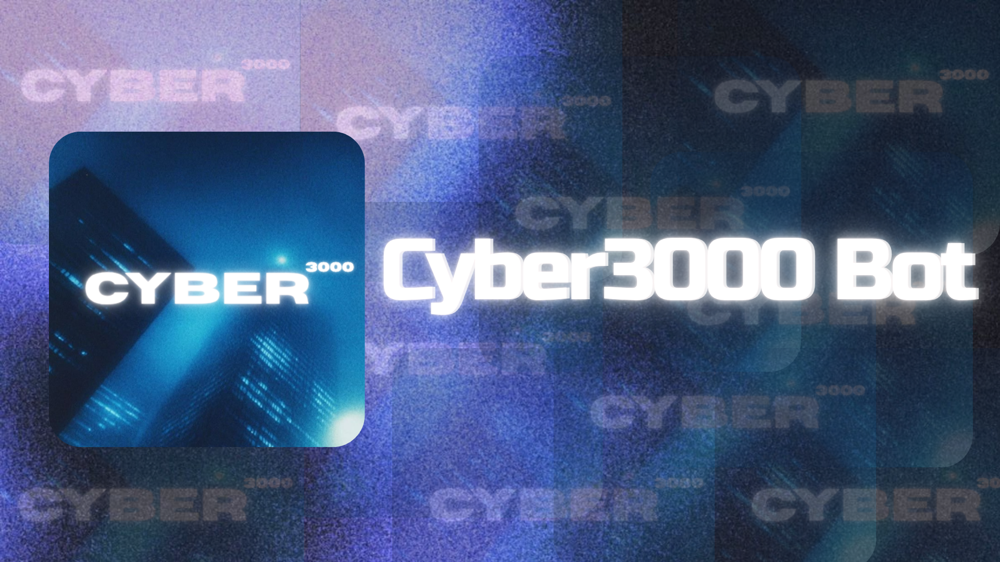

# Cyber3000 [ In progress 🚧]
   
A Slackbot that brings Y2K cyber-nostalgia, specifically for nerds, tech archaeologists, and 2000s era enthusiasts. 
#
**Cyber3000** is a retro-inspired workspace bot built for people who love hardware nostalgia, quirky wisdom, and retro computing culture. Cyber3000 delivers throwback facts, tech history, and lifestyle memories straight into your Slack channels.

Whether you're reminiscing about early-2000s gadgetry or looking for a quick spot of wisdom, Cyber3000 is the ultimate sidekick for your workspace.
#
## Commands
| Command                 | Description                                                            | Usage Example			
| ------------            | -----------------------------------------------------------            | ---------------------------------
| `/cyber3000-seek`       | Gives a summary about the keyword entered                              | `/cyber3000-seek <keyword>`
| `/cyber3000-advice`     | Drops a random piece of advice to get you through the workday.         | `/cyber3000-advice`
| `/cyber3000-ping`       | Basic command to check the latency of the bot                          | `/cyber3000-ping`

## Built With:
**Slackbot**: Coded in JavaScript (Node.js) using Slack's Bolt Framework

#
##### APIs used: https://api.adviceslip.com/ and https://api.duckduckgo.com/   Banner: Made and edited on [Canva](canva.com)